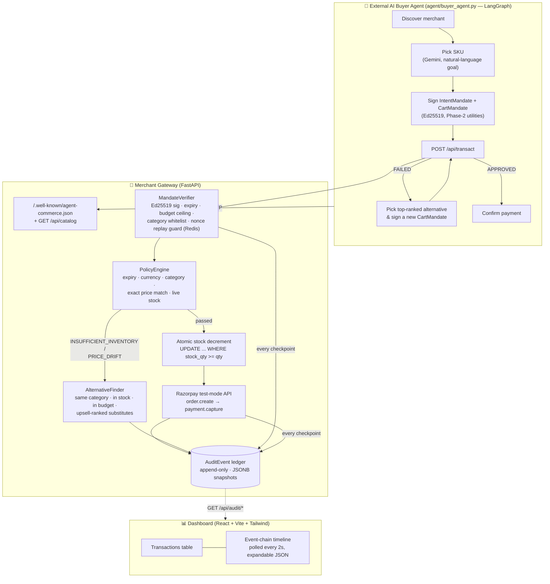

# AgentGate - An AP2 Merchant Gateway

**A Razorpay merchant that an AI agent can discover, reason about, and transact with end-to-end — every money action explainable, bounded, gated, and logged.**

Built for **Track 01 — AI Growth & Agentic Commerce**: making a merchant transactable by an AI buyer, with a real recovery path when something goes wrong, not just the happy path.

- [Project Objectives](#project-objectives)
- [Solution Overview](#solution-overview)
- [Architecture](#architecture)
- [Alignment with Evaluation Criteria](#alignment-with-evaluation-criteria)
- [Design Rationale: AI Usage Boundaries](#design-rationale-ai-usage-boundaries)
- [Project structure](#project-structure)
- [Running it](#running-it)
- [API reference](#api-reference)
- [Tests](#tests)
- [What broke, and what I did about it](#what-broke-and-what-i-did-about-it)
- [Known limitations](#known-limitations)

---

## Project Objectives

A growing problem in agent-to-agent commerce is that there's no safe, standardized way for an AI agent to make a purchase on a human's behalf — either the agent is given raw payment credentials, which is risky, or a merchant has to trust an API key with no real limits on what it can spend or when. This project addresses that using a signed-mandate protocol modeled on AP2 (Google's Agent Payments Protocol) — the human signs one authorization once, setting a hard budget and category limit, and the agent signs a separate mandate for each specific purchase against it, using actual Ed25519 cryptographic signatures, not API keys. Nothing can spend outside what was authorized, and every mandate can only be used once (replay protection via Redis), so an agent physically cannot overspend or replay an old authorization even if it tried.

On top of that, the system handles failure as a first-class case: when a purchase fails — say an item's out of stock — it doesn't just throw an error back at the agent. It queries the live catalog for in-stock substitutes in the same category, ranks the ones priced above the original item first (an upsell opportunity, not just a fallback), and the agent automatically signs a new mandate and retries. Every single step of this — verified, budgeted, policy-checked, failed, recovered, settled — gets written to an append-only audit ledger that has no update or delete endpoint anywhere, with a live dashboard showing it happen in real time.

The project also includes an actual external AI buyer agent (LangGraph + Gemini) that discovers the merchant, reasons about a natural-language shopping goal, and completes the whole transaction on its own — so this isn't just backend plumbing, it's a working demonstration of the exact scenario the problem statement describes.

---

## Solution Overview

Two things have to both be true for agent-to-agent commerce to work: an AI buyer has to be able to _transact_ with a merchant without a human clicking through checkout, and the merchant has to be able to _trust_ that transaction — bounded to a budget, gated by cryptographic authorization, and fully explainable after the fact.

This repo is a merchant gateway that does both, plus a real external buyer agent that proves it:

1. **A signed-mandate protocol** (Ed25519, AP2-shaped) — a human authorizes a budget once (`IntentMandate`), an agent spends against it per-cart (`CartMandate`), and the server verifies the whole chain cryptographically before a rupee moves.
2. **A deterministic policy engine** that gates every transaction on expiry, budget, category, exact price match, and live stock — before touching Razorpay.
3. **A graceful-failure engine** — when an item is out of stock or its price drifted, the merchant doesn't just error out. It ranks in-stock substitutes (upsell-first, within the buyer's authorized budget) and lets the agent retry automatically. No funds move, no order is created, and it's logged as a `FAILURE_DIVERTED`, not a raw 500.
4. **An append-only audit ledger** with no update/delete route anywhere in the API — every checkpoint from mandate verification to settlement is a permanent, timestamped, JSON-snapshotted event — plus a live dashboard that renders it as a timeline.
5. **A real external buyer agent** (LangGraph + Gemini) that discovers this merchant via a `.well-known` manifest, picks a product from a natural-language goal, signs its own mandates, and completes — or recovers from — a real transaction. Verified against a **real Razorpay test-mode account**, not just mocks.

---

## Architecture



**The pipeline, in order, for every `POST /api/transact`:**

1. Parse the `CartMandate` JSON the agent sent.
2. **Verify it cryptographically** — Ed25519 signature over canonical (sorted-key) JSON, expiry, resolve the parent `IntentMandate` from Redis, check the cart total against the intent's budget ceiling, check every SKU's category against the intent's whitelist, and burn the cart's nonce (Redis `SET NX` + TTL) so it can never be replayed. → `CART_VERIFIED`, `BUDGET_PASSED`
3. **Run the policy engine** against the live catalog — expiry, currency, category, _exact_ price match (zero tolerance — any drift is treated as a live price change, not rounded away), and requested qty vs. live stock. → `POLICY_PASSED`, or a diverted failure
4. **Atomically decrement stock** with a single conditional `UPDATE ... WHERE stock_qty >= qty` — this closes the classic read-check-write race under concurrent buyers, proven by a dedicated concurrency test.
5. **Create the Razorpay order**, rolling back the stock decrement if that call fails. → `ORDER_CREATED`
6. Persist the `Transaction` row and return `APPROVED` with the order ID for payment capture. → `SETTLED` on confirm.

If step 3 fails on `INSUFFICIENT_INVENTORY` or `PRICE_DRIFT`, steps 4–6 never run. Instead, the recovery engine takes over (see below).

---

## Alignment with Evaluation Criteria

> _Every money action explainable, bounded and gated. Show the audit trail and one failure handled gracefully._

| Requirement                        | Where                                                                                                                                                                                                                                                                                                                                                                                                                                                               |
| ---------------------------------- | ------------------------------------------------------------------------------------------------------------------------------------------------------------------------------------------------------------------------------------------------------------------------------------------------------------------------------------------------------------------------------------------------------------------------------------------------------------------- |
| **Bounded**                        | `IntentMandate.max_amount_paise` (budget ceiling) + `allowed_categories` (whitelist) + `expires_at` on both mandates — enforced before any policy check runs.                                                                                                                                                                                                                                                                                                       |
| **Gated**                          | Ed25519 signature verification + nonce replay protection (Redis `SET NX`) — an agent can't spend without a cryptographically valid, single-use, budget-scoped authorization chain.                                                                                                                                                                                                                                                                                  |
| **Explainable**                    | Every checkpoint — `INTENT_VERIFIED → CART_VERIFIED → BUDGET_PASSED → POLICY_PASSED → ORDER_CREATED → SETTLED` (or a diversion) — is a permanent `AuditEvent` row with a JSON snapshot of what was true at that instant.                                                                                                                                                                                                                                            |
| **Audit trail**                    | `GET /api/audit/{intent_id}` returns the full ordered chain. There is no `PATCH`/`DELETE` route on it anywhere — not soft-disabled, just never wired up. Try one; you get a 404 or 405.                                                                                                                                                                                                                                                                             |
| **One failure handled gracefully** | Stock-out or price-drift on a cart item → the merchant queries live catalog for in-stock, in-budget, same-category substitutes, ranks upsell candidates first, and returns them in a structured `FAILED` payload with `requires_new_mandate: true`. No funds moved, no order created — proven by a test asserting **zero** new `Transaction` rows on this path. The buyer agent then signs a fresh `CartMandate` for the top alternative and retries automatically. |

---

## Design Rationale: AI Usage Boundaries

The rubric asks for "the right tool in the right place, **and where you chose not to use one**." Here's the actual split:

- **Policy engine, stock decrement, alternative ranking — zero LLM calls.** These touch money and inventory directly, so they're plain deterministic Python and SQL: exact comparisons, atomic conditional `UPDATE`s, a sort by price delta. Predictable, testable, and auditable — an LLM has no business deciding whether a price drifted.
- **The one place an LLM is used: turning a human's fuzzy natural-language goal ("running shoes, size 9, under ₹3000") into a specific SKU choice.** That's genuinely a judgment call an LLM is good at and rule-based code isn't.
- **The LLM call is not on the critical path for correctness.** If Gemini errors, times out, or (as happened live during testing) returns a transient `503`, the agent falls back to a deterministic heuristic (cheapest in-stock match) and the transaction still proceeds through the same cryptographic and policy gates. A bad LLM call degrades the _shopping experience_, never the _safety_ of the transaction.

---

## Project structure

```
ap2-merchant-gateway/
  app/
    api/            # FastAPI routers
      mandates.py     # POST /api/mandates/intent, /verify-cart
      transact.py     # POST /api/transact, confirm-payment, list/get, recovery
      audit.py        # GET /api/audit/{intent_id}, /latest  (read-only, on purpose)
      catalog.py      # GET /api/catalog
      discovery.py    # GET /.well-known/agent-commerce.json
      health.py
    core/           # Settings, security primitives
    db/             # Async SQLAlchemy engine, session, declarative base
    models/         # ORM: Product, PolicyEvaluation, Transaction, AuditEvent
    schemas/        # Pydantic v2 request/response contracts
    services/
      mandates.py        # Ed25519 sign/verify, canonical JSON, nonce replay guard
      policy_engine.py   # Deterministic pre-transaction guardrails
      stock.py            # Atomic, race-safe stock decrement/rollback
      alternative_finder.py  # In-stock, in-budget, upsell-ranked substitutes
      catalog.py          # Catalog reads + PolicyEvaluation audit writes
      audit.py            # Append-only AuditEvent ledger
      razorpay_client.py  # Async wrapper over the Razorpay SDK
    main.py
  agent/
    buyer_agent.py    # Standalone LangGraph "AI buyer" — discovery → LLM SKU
                      # pick → mandate signing → transact → settle/recover
  frontend/           # Vite + React + Tailwind audit dashboard
    src/
      App.jsx                     # polling, "replay latest" state
      components/
        TransactionsTable.jsx     # status badges
        Timeline.jsx              # vertical event-chain UI
        AlternativesList.jsx      # upsell badge on recovery alternatives
        JsonPayload.jsx
  scripts/
    seed_catalog.py     # 34 SKUs, 5 categories, deliberate stock-outs for the demo
    generate_keypair.py
    sign_sample_mandate.py
  tests/                # 92 tests across every phase (pytest, pytest-asyncio)
  docker-compose.yml    # Postgres + Redis
  requirements.txt / pyproject.toml
  Makefile
```

---

## Running it

### Prerequisites

Python 3.11+, Node 18+, Docker (for Postgres + Redis).

### 1. Infrastructure

```bash
docker compose down -v
docker compose up -d postgres redis
```

### 2. Backend

```bash
pip install -r requirements.txt
cp .env.example .env
```

Edit `.env`:

```bash
RAZORPAY_KEY_ID=rzp_test_...       # from dashboard.razorpay.com, Test Mode
RAZORPAY_KEY_SECRET=...
GEMINI_API_KEY=...                 # only needed for the buyer agent's LLM step
```

```bash
uvicorn app.main:app --reload --port 8000
```

Tables and enums are created automatically on startup. Then seed a realistic demo catalog:

```bash
python scripts/seed_catalog.py
```

### 3. Dashboard

```bash
cd frontend
npm install
npm run dev    # http://localhost:5173 — proxies /api to :8000, zero config
```

### 4. The buyer agent (the actual demo)

There are two ways to run the server, depending on which outcome you want to see —
**both exercise the exact same mandate signing, policy engine, stock decrement,
recovery engine, and audit ledger.** The only thing that differs is whether the
Razorpay calls are real.

**Demo run — always ends `✅ SETTLED`.** Razorpay is faked (order creation and
payment capture both auto-succeed); Gemini is still real. Use this to show the
happy path and the recovery path end-to-end without needing a manual checkout step:

```bash
python scripts/run_demo_server.py          # instead of uvicorn — port 8000
# in another terminal:
python agent/buyer_agent.py --goal "running shoes, size 9, under 3000"
python agent/buyer_agent.py --force-failure   # OOS SKU → recovery → still settles
```

**Real run — proves the actual Razorpay integration.** A genuinely real test-mode
order gets created (check it in your Razorpay Dashboard → Test Mode), but
capture is correctly **rejected** — `❌ FAILED` / `CAPTURE_REJECTED` on the
timeline — because the demo doesn't drive an actual checkout, and a real gateway
correctly refuses to capture a payment that never happened:

```bash
uvicorn app.main:app --reload --port 8001    # the real server (make dev)
# in another terminal:
python agent/buyer_agent.py --goal "running shoes, size 9, under 3000" --base-url http://127.0.0.1:8001
python agent/buyer_agent.py --force-failure --base-url http://127.0.0.1:8001
```

To make the real run end `SETTLED` too, complete one Razorpay Checkout
test-mode payment by hand and pass the real payment ID through:

```bash
python agent/buyer_agent.py --goal "..." --payment-id pay_xxxxxxxxxxxxx
```

Watch any of the above land on the dashboard in real time. Each phase prints a
labeled banner (`PHASE: 1 · DISCOVERY`, `PHASE: 5 · RECOVERY`, ...) for narration.

### 5. Tests

```bash
pytest -v
```

### Makefile shortcuts (if you use Poetry)

`make db-up` · `make dev` · `make dev-demo` · `make seed` · `make test` · `make lint` — see [Makefile](Makefile).

---

## API reference

| Method | Path                                       | Purpose                                                           |
| ------ | ------------------------------------------ | ----------------------------------------------------------------- |
| `GET`  | `/.well-known/agent-commerce.json`         | Discovery manifest: endpoints, mandate scheme, transact lifecycle |
| `GET`  | `/api/catalog`                             | Live product catalog                                              |
| `POST` | `/api/mandates/intent`                     | Register a signed `IntentMandate`                                 |
| `POST` | `/api/mandates/verify-cart`                | Standalone `CartMandate` verification (no transaction)            |
| `POST` | `/api/transact`                            | Full pipeline: verify → policy → stock → Razorpay order           |
| `POST` | `/api/transact/{order_id}/confirm-payment` | Capture payment, settle or fail                                   |
| `GET`  | `/api/transact`                            | List all transactions (dashboard table)                           |
| `GET`  | `/api/transact/{order_id}`                 | Single transaction status                                         |
| `GET`  | `/api/audit/{intent_id}`                   | Full ordered audit-event chain for one flow                       |
| `GET`  | `/api/audit/latest`                        | `intent_id` of the most recently active flow                      |
| `GET`  | `/health`                                  | DB + Redis connectivity check                                     |

Interactive docs at `/docs` once running.

---

## Tests

**92 tests**, `pytest -v`, covering every phase against real async Postgres (SQLite in-memory for speed) and fakeredis — not just unit tests:

- Mandate signing/verification: tampered signatures, replay, budget/category/expiry edge cases.
- Policy engine: every rejection reason, boundary conditions (qty == stock, price exact match).
- Concurrency: two agents racing for the last unit of stock — exactly one wins, proven by asserting the loser gets `INSUFFICIENT_INVENTORY`, not a corrupted stock count.
- Recovery: out-of-stock → alternatives returned, **zero** new `Transaction` rows, `FAILURE_DIVERTED` audit event with the full recovery payload attached, upsell-ranking order.
- Audit ledger: full chain ordering, `/latest`, and immutability — `DELETE`/`PATCH`/`PUT` on the audit API all return 404/405.

---

## Build Challenges & Technical Obstacles

Most of the genuinely hard parts of this project weren't the architecture — they were the kind of infrastructure issues that only surface once you run your code against real services instead of assuming it works.

The one I'd point to first: my buyer agent script was printing `✅ SETTLED` after every run, even when payment capture had actually failed — because it wasn't checking the response of the capture call at all, just assuming success. This never showed up while testing against a mocked payment gateway, because mocks always "succeed." It only surfaced when I ran the same script against my actual Razorpay test account, which correctly rejected a payment ID that didn't correspond to a real checkout. That mismatch is what exposed the bug — a real lesson that testing against mocks alone will hide correctness bugs in your own code, not just in the thing you're mocking. Fixed to honestly report `CAPTURE_REJECTED` with the real reason, and added a `--payment-id` flag so a genuinely captured test payment can be fed through for a fully real settle.

I also hit a live, currently-unresolved issue with Google's Gemini API: they're mid-rollout of a new API key format (`AQ.`-prefixed) that a whole SDK layer (`langchain_google_genai`) doesn't handle correctly yet, throwing a confusing `401` error even with a totally valid key. I confirmed this by testing the same key directly against the raw REST API and the plain `google-genai` SDK — both worked instantly — which told me the bug was in the wrapper library, not my key or my code. Fixed it by dropping the wrapper and calling the SDK directly for structured output.

A more classic one: SQLAlchemy's `create_all()` only creates tables that don't exist yet — it silently does nothing if you add a new column or enum value to a table that's already been created. I hit this twice across the project and now always double-check schema changes against an existing dev database, not just a fresh one. Fixed with a targeted `ALTER TYPE ... ADD VALUE` / `ALTER TABLE ... ADD COLUMN` against the dev DB each time.

There was also a genuine race condition to solve for real: two agents buying the last unit of the same item at the same time. Fixed with a single atomic `UPDATE ... WHERE stock_qty >= qty` instead of a read-then-write check, and I wrote a concurrency test that fires two real concurrent requests to prove exactly one wins and stock never goes negative — I didn't want to just assume it was safe.

---

## Known limitations

- **Payment capture isn't scripted end-to-end against the real Razorpay API.** Razorpay (by design, even in test mode) requires an actual Checkout flow with a real payment before it can be captured — a backend script can't fabricate that, and shouldn't be able to. Order _creation_ is verified for real against Razorpay's API; capture needs one manual test-mode checkout (`--payment-id` flag above), matching how a real production agent would never own the capture step either — that's the checkout widget's job. `scripts/run_demo_server.py` sidesteps this for demo purposes by faking only the Razorpay client (see "Running it" above) — everything else in that mode is still real.
- **Revenue-growth surface is thin.** This build leans almost entirely on the "make a merchant transactable" half of the track; the upsell-first ranking in the recovery path is the one place it touches revenue growth directly. No conversational checkout or campaign orchestrator yet.
- **Single merchant, demo-scale catalog** (34 SKUs / 5 categories) — enough to make the recovery and upsell logic behave realistically, not a production catalog depth test.
